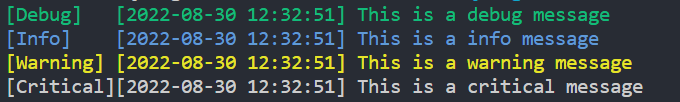
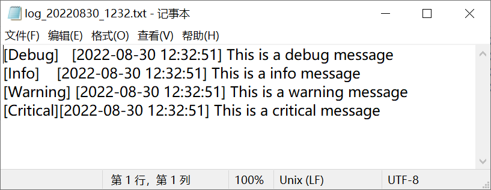

# 基于qDebug的调试log（日志记录）
## 重定向qDebug的输出
.log文件输出+控制台输出  
```
//声明一个全局的回调函数
void outputMsg(QtMsgType type, const QMessageLogContext &context, const QString &msg){
    /*
    打开文件，组织字符串写入
    */
}
int main(){
    //安装回调函数
    qInstallMessageHandler(outputMsg);
}
//调用qInstallMessageHandler，传入回调函数指针，qDebug最后的输出将会送入这个回调函数，QMessageLogContext包含了文件名、函数名、行号等信息，msg则是输出的信息。
//Qt5源码中的声明
class QMessageLogContent{
    ...
    int version;
    int line;
    const char* file;
    const char* function;
    const char* category;
    ...
};
```
还可以将日志输出到窗口、socket、控制台等等，实现方式自定义

**注意**
1. 回调函数内的实现不可使用qDebug，否则会造成死递归，如需打印调试使用printf和std::cout均可
2. 注意加锁以支持多线程qDebug()
## 类型
- qDebug()	调试消息
- qInfo()	信息消息
- qWarning()	警告消息和可恢复的错误
- qCritical()	关键错误和系统错误
- qFatal()	致命错误

**控制台颜色输出**  
不同类型的日志前缀不同的颜色码，并且该条日志输出之后，需要恢复颜色到原始状态\033[0m，否则后续第三方库调用printf的输出会一直保持这个颜色，造成颜色显示错乱
```
static QString arrColor[] = {"", "\033[32m","\033[33m","\033[31m","\033[35m"};// 默认 绿 黄 红 紫
//event属于自定义结构体，包含日志类型和函数名、行号等信息。
fprintf(stdout,"%s %s\n\033[0m",arrColor[event.level].toStdString().c_str(),m_fmtter.fmt(event).toLocal8Bit().constData());
fflush(stdout);
```

**release模式显示函数名、行号等信息
DEFINES += QT_MESSAGELOGCONTEXT
## test result



## Reference
[Qt documentation - QDebug Class](https://doc.qt.io/qt-6/qdebug.html)

[QtMessageHandler](https://doc.qt.io/qt-5/qtglobal.html#qInstallMessageHandler)

[QT重定向QDEBUG，自定义一个简易的日志管理类](https://www.freesion.com/article/49341199626/)

[Qt - 消息重定向(输出日志)](https://blog.csdn.net/qq_39453936/article/details/120675366)

[qDebug用法详解](https://blog.csdn.net/qq_41673920/article/details/119800322)

[QT日志模块的个性化使用](http://www.cleartechfei.com/2022/06/qt%E6%97%A5%E5%BF%97%E6%A8%A1%E5%9D%97%E7%9A%84%E4%B8%AA%E6%80%A7%E5%8C%96%E4%BD%BF%E7%94%A8/)


### 指定qDebug的输出格式
```
int main(){
    qSetMessagePattern("[%{type}] %{time yyyy-MM-dd hh:mm:ss.zz}  %{function}:%{line} %{message}");
    qDebug()<<"hello";
}
//输出
[warning] 2021-08-19 10:10:59.886  main:32 hello
```
支持字段 | 描述
------------ | -------------
%{appname} |  QCoreApplication::applicationName()
%{category} |  日志类别
%{file} |  源文件路径
%{function} |  函数名
%{line} |  在源文件中的行号
%{message} |  实际的信息
%{pid} |  QCoreApplication::applicationPid()
%{threadid} | 线程Id 
%{qthreadptr} |  当前线程指针
%{type} |  “debug”, “warning”, “critical” or “fatal”
%{time process}	| 该进程启动以来的时间
%{time boot} | 自软件运行以来的时间
%{time [format]} | 当前时间，支持自定义时间戳格式
%{backtrace [depth=N] [separator="…"]} | 程序异常时的堆栈信息
